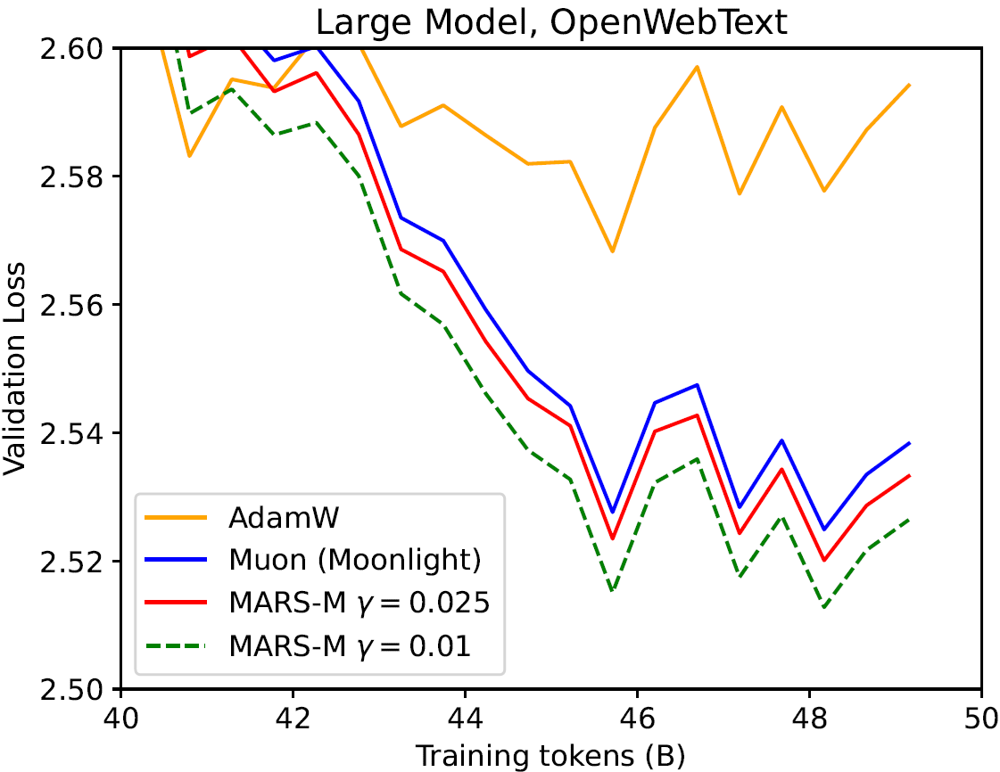
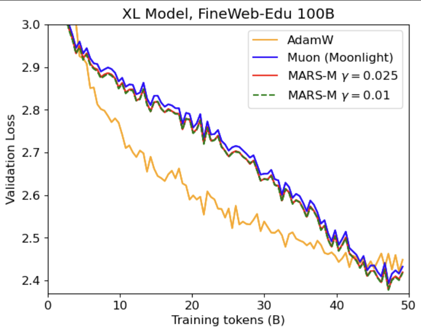

# MARS-M: When Variance Reduction Meets Matrices

This repository contains the official code for our project "MARS-M: When Variance Reduction Meets Matrices".

Authors: [Yifeng Liu](https://scholar.google.com/citations?user=mFvOVkMAAAAJ&hl=zh-CN)\*, [Angela Yuan](https://scholar.google.com/citations?user=8foZzX4AAAAJ)\*, [Quanquan Gu](https://web.cs.ucla.edu/~qgu/)

## 🔔 NEWS

- **[10/05/2025]** Our code is released.

## MARS-M

**MARS-M** is a brand-new optimizer that integrates matrix-based optimizer (i.e., Muon and Moonlight) with the variance-reduction based optimizer MARS to reduce high stochastic gradient variance in the training process.

In detail, the **MARS-M** optimizer is built on **MARS** framework:

---

**Algorithm 1** MARS

---

$$
\begin{align*}
&\pmb{input: }\mathbf{x}_0\in\mathbb{R}^{A\times B}, \lambda, \beta, \{\gamma_t\}, \{\eta_t\}\\
&\text{Set }\mathbf{m}_0\leftarrow \mathbf{0}\textbf{ and }\mathbf{x}_1\leftarrow\mathbf{x}_0\\
&\pmb{for }\textbf{ }t=1,\pmb{ to }\textbf{ }n\textbf{ }\pmb{ do}\\
&\qquad\textbf{sample }\mathbf{\xi}_t\textbf{ and let }\mathbf{c}_t = \nabla f(\mathbf{x}_t, \mathbf{\xi}_t)+\gamma_t\bigg(\frac{\beta}{1-\beta}\bigg)\big(\nabla f(\mathbf{x}_t, \mathbf{\xi}_t)-\nabla f(\mathbf{x}_{t-1}, \mathbf{\xi}_t)\big)\\
&\qquad\mathbf{m}_t = \beta \mathbf{m}_{t-1} + (1-\beta)\text{Clip}(\mathbf{c}_t, 1)\\
&\qquad\mathbf{x}\_{t+1} = \arg\min_{\mathbf{x} \in \mathbb{R}^d} \left\\{\eta_t \left\langle \mathbf{m}_t, \mathbf{x} \right\rangle + \frac{1}{2} \\|\mathbf{x} - \mathbf{x}\_t
\\|\_{\mathbf{H}_t}^2\right\\}\\
&\pmb{end}\textbf{ }\pmb{for}
\end{align*}
$$

---

where

$$
\text{Clip}(\mathbf{c}_t,1) =  \begin{cases}
\frac{\mathbf{c}_t}{\\|\mathbf{c}_t\\|_2} & \text{if } \\|\mathbf{c}_t\\|_2 > 1,\\
\mathbf{c}_t & \text{otherwise}.
\end{cases}
$$


Here ${\color{red}\gamma_t}$ is a scaling parameter that controls the strength of gradient correction and plays a central role in MARS.

Under the **MARS** framework, we propose **MARS-M** that applies MARS to matrix-based optimizers (See  `optimizers/mars_m.py` for the implementation):

---

**Algorithm 2** MARS-M

---

$$
\begin{align*}
&\pmb{input: }\mathbf{X}_0\in\mathbb{R}^{A\times B}, \lambda, \beta, \{\gamma_t\}, \{\eta_t\}\\
&\text{Set }\mathbf{M}_0\leftarrow \mathbf{0}\textbf{ and }\mathbf{X}_1\leftarrow\mathbf{X}_0\\
&\pmb{for }\textbf{ }t=1,\pmb{ to }\textbf{ }n\textbf{ }\pmb{ do}\\
&\qquad\textbf{sample }\mathbf{\xi}_t\textbf{ and let }\mathbf{C}_t = \nabla f(\mathbf{X}_t, \mathbf{\xi}_t)+\gamma_t\bigg(\frac{\beta}{1-\beta}\bigg)\big(\nabla f(\mathbf{X}_t, \mathbf{\xi}_t)-\nabla f(\mathbf{X}_{t-1}, \mathbf{\xi}_t)\big)\\
&\qquad\mathbf{M}_t = \beta \mathbf{M}_{t-1} + (1-\beta)\text{Clip}(\mathbf{C}_t, 1)\\
&\qquad\mathbf{O}_t = \text{NewtonSchulz}(\mathbf{M}_t)\\
&\qquad\mathbf{X}_{t+1} = \mathbf{X}_t - \eta_t(0.2\cdot\mathbf{O}_t\cdot\sqrt{\max(A,B)} +  \lambda \mathbf{X}_t)\\
&\pmb{end}\textbf{ }\pmb{for}
\end{align*}
$$

---

To accelerate training process, we also propose the approximated version of MARS-M by substituting $f(\mathbf{X}\_{t-1}, \mathbf{\xi}\_t)$ with $f(\mathbf{X}\_{t-1}, \mathbf{\xi}\_{t-1})$ as follows:

---

**Algorithm 3** MARS-M-approx

---

$$
\begin{align*}
&\pmb{input: }\mathbf{X}_0\in\mathbb{R}^{A\times B}, \lambda, \beta, \{\gamma_t\}, \{\eta_t\}\\
&\text{Set }\mathbf{M}_0\leftarrow \mathbf{0}\textbf{ and }\mathbf{X}_1\leftarrow\mathbf{X}_0\\
&\pmb{for }\textbf{ }t=1,\pmb{ to }\textbf{ }n\textbf{ }\pmb{ do}\\
&\qquad\textbf{sample }\mathbf{\xi}_t\textbf{ and let }\mathbf{C}_t = \nabla f(\mathbf{X}_t, \mathbf{\xi}_t)+\gamma_t\bigg(\frac{\beta}{1-\beta}\bigg)\big(\nabla f(\mathbf{X}_t, \mathbf{\xi}_t)-\nabla f(\mathbf{X}_{t-1}, \mathbf{\xi}_{t-1})\big)\\
&\qquad\mathbf{M}_t = \beta \mathbf{M}_{t-1} + (1-\beta)\text{Clip}(\mathbf{C}_t, 1)\\
&\qquad\mathbf{O}_t = \text{NewtonSchulz}(\mathbf{M}_t)\\
&\qquad\mathbf{X}_{t+1} = \mathbf{X}_t - \eta_t(0.2\cdot\mathbf{O}_t\cdot\sqrt{\max(A,B)} +  \lambda \mathbf{X}_t)\\
&\pmb{end}\textbf{ }\pmb{for}
\end{align*}
$$

---

### **Performance of MARS-M Compared to Baseline of Muon (Moonlight) and AdamW**

#### Experiment Settings

We implement grid search on learning rates for AdamW and Muon (Moonlight) and use the same hyper-parameters of Muon (Moonlight) for experiments with **MARS-M**.

#### Experiments on OpenWebText

In our experiments, gradients are calculated once per sample and per update (**MARS-M**-approx). Performing exact gradient computation with two evaluations per update, as in the exact form of **MARS-M**, can slightly enhance performance but at the cost of doubling the computational cost. Moreover, **MARS-M** also outperforms AdamW for the best loss value. 

**MARS-M** consistently outperforms [Muon (Moonlight version)](https://arxiv.org/abs/2502.16982) optimizers across GPT-2 models:

| **GPT-2 small**                            | **GPT-2 medium**                            | **GPT-2 large**                            |
| ------------------------------------------------ | ------------------------------------------------- | ------------------------------------------------ |
|  |  |  |

---

Zoomed-in loss curves
| **GPT-2 small**                            | **GPT-2 medium**                            | **GPT-2 large**                            |
| ------------------------------------------------ | ------------------------------------------------- | ------------------------------------------------ |
|  |  |  |

#### Experiments on FineWeb-Edu

Below are the training and validation loss curves for both GPT‑2 Small and GPT‑2 XL when using our MARS-M approach versus [Muon (Moonlight version)](https://arxiv.org/abs/2502.16982) optimizers. As you can see, MARS-M often yields faster convergence and consistently lower losses across different training steps. Moreover, **MARS-M** also outperforms AdamW for the best loss value. 

| Model                     | **GPT-2 small**                              | **GPT-2 XL**                              |
| ------------------------- | -------------------------------------------------- | ----------------------------------------------- |
| **Train Loss**      |  |  |
| **Validation Loss** |    |    |

---

Zoomed-in loss curves
| Model                     | **GPT-2 small**                              | **GPT-2 XL**                              |
| ------------------------- | -------------------------------------------------- | ----------------------------------------------- |
| **Train Loss**      |  |  |
| **Validation Loss** |    |    |

## Training GPT-2 from Scratch:

### Install Dependencies

```
$ pip install torch==2.1.2 transformers==4.33.0 datasets tiktoken numpy==1.26.4 wandb
```

### Data Preparation

Prepare the [OpenWebText](https://huggingface.co/datasets/openwebtext) data following [nanoGPT](https://github.com/karpathy/nanoGPT/):

```
$ python data/openwebtext/prepare.py
```

### **Start Training**

To train a model using the **MARS-M** optimizer, run the following command:

```bash
$ torchrun --standalone --nproc_per_node=8 train_mars_m.py config/${your_config_file}
```

This command initiates the training of a GPT-2 model on the OpenWebText dataset using the **MARS-M** optimizer. All relevant hyperparameters—training, model, and optimizer—are specified in the configuration file (`${your_config_file}`). These parameters can be adjusted directly in the configuration file or through the bash script.

### **Hyperparameter Details**

#### **Model Hyperparameters**:

- **n_layer**: Layers of networks, 12 for GPT2 Small, 24 for GPT2 Medium, 36 for GPT2 Large
- **n_head**: Number of heads, 12 for GPT2 small, 16 for GPT2 Medium, 20 for GPT2 Large
- **n_embd**: Embedding dimension, 768 for GPT2 small, 1024 for GPT2 Medium, 1280 for GPT2 Large

#### **Optimizer Hyperparameters**:

- **`learning_rate`**: Learning rate for the **MARS-M** optimizer.
- **`weight_decay`**: Weight decay for the **MARS-M** optimizer.
- **`beta1`**: momentum for **MARS-M** optimizer.

  - Default: `beta1=0.95, beta2=0.99`
- **`betas_1d`**: Weights for exponential moving average in AdamW optimizer (for 1d parameters).

  - Default: `(0.9, 0.95)`
- **`is_approx`**: Whether to use approximate gradient calculation (**MARS-M**-approx).

  - Default: `True`
- **`gamma`**: The scaling parameter that controls the strength of gradient correction.

  - Default: 0.025

#### **Training Hyperparameters**:

- **`batch_size`**: Mini-batch size per device. (for example GPT-2 Small on an A100 GPU typically uses a batch size of 15.)
- **`gradient_accumulation_steps`**: Gradient accumulation steps to ensure the total effective batch size matches the desired scale. (for example, for a total batch size of 480: $15 \times 4 \times 8 \, \text{GPUs}$.)
- **`schedule`**: learning rate schedule.
  - Default: `cosine`

For more detailed hyperparameter examples, refer to:

- `config/train_gpt2_small_mars_m.py`
- `scripts/run_mars_m_small.sh`

---

### Reproducing Our Results

#### **Reproducing GPT-2 Small (125M) Results**

Training with MARS-M using

```
$ bash scripts/run_mars_m_small.sh
```

or

```
$ torchrun --standalone --nproc_per_node=8 \
      train_mars_m.py \
      config/train_gpt2_small_mars_m.py \
      --batch_size=15 \
      --gradient_accumulation_steps=4
```

#### Reproducing GPT2 Medium (355M) Results

Training with MARS-M using

```
$ bash scripts/run_mars_m_medium.sh
```

or

```
$ torchrun --standalone --nproc_per_node=8 \
      train_mars_m.py \
      config/train_gpt2_medium_mars_m.py \
      --batch_size=15 \
      --gradient_accumulation_steps=4
```

#### Reproducing GPT2 Large (770M) Results

Training with MARS-M using

```
$ bash scripts/run_mars_m_large.sh
```

or

```
$ torchrun --standalone --nproc_per_node=8 \
      train_mars_m.py \
      config/train_gpt2_large_mars_m.py \
      --batch_size=5 \
      --gradient_accumulation_steps=12
```

#### **Reproducing GPT-2 XL (1.5B) Results on FineWeb-Edu**

```
$ bash scripts/run_mars_m_xl_fw.sh
```

or

```
$ torchrun --standalone --nproc_per_node=8 \
      train_mars_m_fw.py \
      config/train_gpt2_xl_mars_m.py \
      --batch_size=5 \
      --gradient_accumulation_steps=12
```

#### Reproducing Baseline Results

To reproduce the Moonlight baseline:

```
bash scripts/run_moonlight_{small/medium/large}.sh
```

Other baselines can be implemented with codes in `../MARS` folder.

Please adjust ``nproc_per_node``, ``batch_size``, and ``gradient_accumulation_steps`` accordingly if you use other hardware setup. Make sure their product equals 480.

#### Hyperparameters for GPT-2 models

|  Model Name  | Model Size | OpenWebText LR | FineWeb-Edu LR | weight decay |
| :----------: | :--------: | :------------: | :------------: | :----------: |
| GPT-2 small |    125M    |      6e-3      |      1e-2      |     1e-1     |
| GPT-2 medium |    355M    |      5e-3      |      5e-3      |     1e-1     |
| GPT-2 large |    770M    |      5e-3      |      5e-3      |     1e-1     |
|   GPT-2 xl   |    1.5B    |       -       |      3e-3      |     1e-1     |

### Customized Training

To build your own training pipeline on other architectures and datasets, use the following template as an example:

```python
import torch
import torch.nn.functional as F
from mars_m import MARS_M

# init model loss function and input data
model = Model()
data_loader = ...

# init the optimizer
muon_params = [p for name, p in model.named_parameters() if p.ndim >= 2 and "embed_tokens" not in name and "lm_head" not in name]
adamw_params = [p for name, p in model.named_parameters() if p.ndim < 2 or "embed_tokens" in name or "lm_head" in name]
optimizer = MARS_M(muon_params=muon_params, adamw_params=adamw_params, lr=1e-3, betas=(0.9, 0.95), gamma=0.025)

total_bs = len(data_loader)
bs = total_bs * block_size
k = 10
iter_num = -1

# training loop
for epoch in range(epochs):
    for X, Y in data_loader:
        # standard training code
        logits, loss = model(X, Y)
        loss.backward()
        optimizer.step(bs=bs)
        optimizer.zero_grad(set_to_none=True)
        optimizer.update_last_grad()
        iter_num += 1

```

## Star History

[](https://www.star-history.com/#AGI-Arena/MARS&Date)

## Citation

If you find this repo useful for your research, please consider citing our github repository:

```tex
@misc{liu2025MARS,
  author = {Yifeng Liu and Angela Yuan and Quanquan Gu},
  title  = {MARS-M: When Variance Reduction Meets Matrices},
  year   = {2025},
  url    = {https://github.com/AGI-Arena/MARS/tree/main/MARS_M/}
}
```

## Acknowledgements

This repo is built upon [nanoGPT](https://github.com/karpathy/nanoGPT/), [levanter](https://github.com/stanford-crfm/levanter/) and [Sophia](https://github.com/Liuhong99/Sophia), we thank the authors for their great work!
