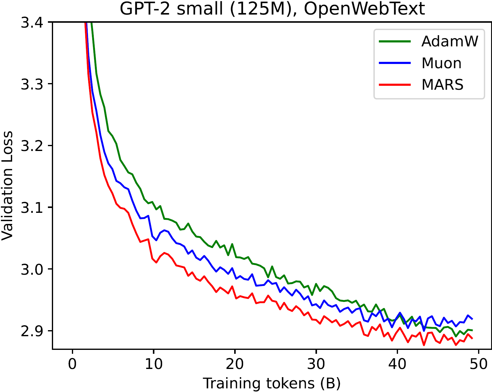

# MARS: Unleashing the Power of Variance Reduction for Training Large Models

This repository contains the official code for the paper [MARS: Unleashing the Power of Variance Reduction for Training Large Models](https://arxiv.org/abs/2411.10438).

Authors: [Huizhuo Yuan](https://scholar.google.com/citations?user=8foZzX4AAAAJ)\*, [Yifeng Liu](https://scholar.google.com/citations?user=mFvOVkMAAAAJ&hl=zh-CN)\*, Shuang Wu, Xun Zhou, [Quanquan Gu](https://web.cs.ucla.edu/~qgu/)

## 🔔 NEWS

- **[01/12/2025]** Our pretraining results on FineWeb-Edu are available.
- **[11/26/2024]** Vision tasks added.
- **[11/18/2024]** Our code is open-sourced!
- **[11/15/2024]** Our paper is released on arXiv: https://arxiv.org/abs/2411.10438.

## About MARS

**MARS** (**M**ake v**A**riance **R**eduction **S**hine) is a unified optimization framework designed to address the inherent challenges of training large models. Traditional adaptive gradient methods like Adam and AdamW often suffer from high stochastic gradient variance, while variance reduction techniques have struggled to gain practical impact in deep learning. At its core, **MARS** comprises two major components: (1) a scaled stochastic recursive momentum, which provides a variance-reduced estimator of the full gradient for better gradient complexity; and (2) the preconditioned update, which approximates the second-order Newton's method for better per-iteration complexity. By combining preconditioned gradient methods with variance reduction, **MARS** achieves the best of both worlds, accelerating the search for critical points in optimization.

The **MARS** framework is built on the following preconditioned variance-reduced updates

$$
\mathbf{c}\_t = \nabla f(\mathbf{x}\_t, \mathbf{\xi}\_t)+\underbrace{{\color{red}\gamma_t} \frac{\beta_{1}}{1-\beta_{1}} \left(\nabla f(\mathbf{x}\_t, \mathbf{\xi}\_t)-\nabla f(\mathbf{x}\_{t-1}, \mathbf{\xi}\_t)\right)}_{\text{scaled gradient correction}}
$$

$$
\tilde{\mathbf{c}}_t = \text{Clip}(\mathbf{c}_t,1) =  \begin{cases}
\frac{\mathbf{c}_t}{\\|\mathbf{c}_t\\|_2} & \text{if } \\|\mathbf{c}_t\\|_2 > 1,\\
\mathbf{c}_t & \text{otherwise}.
\end{cases}
$$

$$
\mathbf{m}\_t = \beta_1 \mathbf{m}\_{t-1} + (1-\beta_{1})\tilde{\mathbf{c}}\_t
$$

$$
\mathbf{x}\_{t+1} = \arg\min_{\mathbf{x} \in \mathbb{R}^d} \left\\{\eta_t \left\langle \mathbf{m}_t, \mathbf{x} \right\rangle + \frac{1}{2} \\|\mathbf{x} - \mathbf{x}\_t
\\|\_{\mathbf{H}_t}^2\right\\}
$$

Here ${\color{red}\gamma_t}$ is a scaling parameter that controls the strength of gradient correction.

### Instantiations of **MARS**

Under the **MARS** framework, we provide three instantiations based on different Hessian matrix approximations: **MARS-AdamW**, **MARS-Lion**, and **MARS-Shampoo**. Please note that the hyperparameters in this framework are tuned on **MARS-AdamW**. When using other instantiations, it is essential to tune the hyperparameters—particularly the learning rates—for optimal performance.

#### MARS-AdamW

(Enable with `mars_type="mars-adamw"` in `mars.py`)

The Hessian matrix approximation is defined as:

$$
\mathbf{v}\_t =\beta_2 \mathbf{v}\_{t-1}+(1-\beta_2) \big(\nabla f(\mathbf{x}\_t, \mathbf{\xi}\_t)\big)^2
$$

$$
\mathbf{H}_t := \sqrt{\text{diag}\Big(\mathbf{v}_t\Big)}\cdot \frac{1 - \beta_1^t}{\sqrt{1 - \beta_2^t}}.
$$

#### MARS-Lion

(Enable with `mars_type="mars-lion"` in `mars.py`)

The Hessian matrix approximation is defined as:

$$
\mathbf{H}_t := \sqrt{\text{diag}(\mathbf{m}_t^2)}.
$$

#### MARS-Shampoo

(Enable with `mars_type="mars-shampoo"` in `mars.py`)

The preconditioner can be seen as an [orthogonal mapping](https://arxiv.org/abs/2409.20325) operator:

$$
\mathbf{U}\_t, \mathbf{\Sigma}\_t, \mathbf{V}\_t = \text{SVD}(\mathbf{G}\_t),\qquad 
    \mathbf{x}\_{t+1} =\mathbf{x}\_t-\eta_t\mathbf{U}_t\mathbf{V}\_t^\top.
$$

In practice, we use the [Newton-Schulz iteration](https://github.com/KellerJordan/modded-nanogpt) to accelerate and approximate the solution of SVD problem.

### **Performance of MARS Compared to Baselines**

#### Experiments on OpenWebText

Experimental results for **MARS** are based on the **MARS-AdamW** instantiation, unless otherwise stated. In our experiments, gradients are calculated once per sample and per update (**MARS**-approx in our [paper](https://arxiv.org/abs/2411.10438)). Performing exact gradient computation with two evaluations per update, as in the exact form of **MARS**, can slightly enhance performance but at the cost of doubling the computational expense. For more details, refer to our [paper](https://arxiv.org/abs/2411.10438).

**MARS** consistently outperforms AdamW and the [Muon]([https://github.com/KellerJordan/modded-nanogpt](https://github.com/KellerJordan/modded-nanogpt/tree/e01b457c7c52e1cd0c592920499a016f5289a69e)) optimizers across GPT-2 models:

| **GPT-2 small**                            | **GPT-2 medium**                            | **GPT-2 large**                            |
| ------------------------------------------------ | ------------------------------------------------- | ------------------------------------------------ |
|  |  |  |

| Best Val Loss         | GPT-2 Small (5B tokens) | GPT-2 Medium (5B tokens) | GPT-2 Large (5B tokens) | GPT-2 Small (20B tokens) | GPT-2 Medium (20B tokens) | GPT-2 Large (20B tokens) | GPT-2 Small (50B tokens) | GPT-2 Medium (50B tokens) | GPT-2 Large (50B tokens) |
| --------------------- | ----------------------- | ------------------------ | ----------------------- | ------------------------ | ------------------------- | ------------------------ | ------------------------ | ------------------------- | ------------------------ |
| AdamW                 | 3.193                   | 3.084                    | 3.013                   | 3.024                    | 2.821                     | 2.741                    | 2.885                    | 2.691                     | 2.561                    |
| Muon                  | 3.165                   | 3.009                    | 2.915                   | 3.006                    | 2.813                     | 2.691                    | 2.901                    | 2.688                     | 2.573                    |
| **MARS**-exact  | **3.107**         | TBD                      | TBD                     | 2.980                    | TBD                       | TBD                      | **2.847**          | TBD                       | TBD                      |
| **MARS**-approx | 3.108                   | **2.969**          | **2.876**         | **2.981**          | **2.763**           | **2.647**          | **2.849**          | **2.636**           | **2.518**          |


#### Efficiency of MARS

The **MARS** algorithm can achieve better performance not only within the same number of training steps, but also within the same training time:

| **GPT-2 small**                             | **GPT-2 medium**                             | **GPT-2 large**                             |
| ------------------------------------------------- | -------------------------------------------------- | ------------------------------------------------- |
|  |  |  |

---

#### Experiments on FineWeb-Edu

---

#### Experiments on Vision Tasks

**MARS** can achieve better test loss and accuracy than AdamW and the [Muon]([https://github.com/KellerJordan/modded-nanogpt](https://github.com/KellerJordan/modded-nanogpt/tree/e01b457c7c52e1cd0c592920499a016f5289a69e)) optimizers on CIFAR-10 and CIFAR-100 datasets with ResNet-18 and MultiStepLR(optimizer, milestones=[100, 150], gamma=0.1) scheduler (We display the best results for each optimizer with grid search of base learning rate within [1e-5, ..., 1e-1]):

| Dataset                 | **CIFAR-10**                                       | **CIFAR-100**                                       |
| ----------------------- | -------------------------------------------------------- | --------------------------------------------------------- |
| **Test loss**     |  |  |
| **Test Accuracy** |   |  |

| Best Test loss        | CIFAR-10   | CIFAR-100  |
| --------------------- | ---------- | ---------- |
| AdamW                 | 0.306      | 2.608      |
| Muon                  | 0.230      | 1.726      |
| **MARS**-approx | **0.199** | **0.971** |

| Best Test Accuracy (%) | CIFAR-10        | CIFAR-100       |
| ---------------------- | --------------- | --------------- |
| AdamW                  | 73.7            | 94.81           |
| Muon                   | 74.64           | 95.08           |
| **MARS**-approx  | **76.97** | **95.29** |


## Training GPT-2 from Scratch:

### Install Dependencies

```
$ pip install torch==2.1.2 transformers==4.33.0 datasets tiktoken numpy==1.26.4 wandb
```

### Data Preparation

Prepare the [OpenWebText](https://huggingface.co/datasets/openwebtext) data following [nanoGPT](https://github.com/karpathy/nanoGPT/):

```
$ python data/openwebtext/prepare.py
```

### **Start Training**

To train a model using the **MARS** optimizer, run the following command:

```bash
$ torchrun --standalone --nproc_per_node=8 MARS/train_mars.py config/${your_config_file}
```

This command initiates the training of a GPT-2 model on the OpenWebText dataset using the **MARS** optimizer. All relevant hyperparameters—training, model, and optimizer—are specified in the configuration file (`${your_config_file}`). These parameters can be adjusted directly in the configuration file or through the bash script.

### **Hyperparameter Details**

#### **Model Hyperparameters**:

- **n_layer**: Layers of networks, 12 for GPT2 Small, 24 for GPT2 Medium, 36 for GPT2 Large
- **n_head**: Number of heads, 12 for GPT2 small, 16 for GPT2 Medium, 20 for GPT2 Large
- **n_embd**: Embedding dimension, 768 for GPT2 small, 1024 for GPT2 Medium, 1280 for GPT2 Large

#### **Optimizer Hyperparameters**:

- **`learning_rate`**: Learning rate for the **MARS** optimizer.
- **`weight_decay`**: Weight decay for the **MARS** optimizer.
- **`beta1, beta2`**: Weights for exponential moving average.
  - Default: `beta1=0.95, beta2=0.99`
- **`mars_type`**: Type of optimizer to use:
  - Options: `mars-adamw`, `mars-lion`, `mars-shampoo`
  - Default: `mars-adamw`
- **`optimize_1d`**: Whether **MARS** should optimize 1D parameters (e.g., layer norm parameters in GPT-2).
  - If `False`, AdamW will be used for optimizing 1D parameters.
  - Default: `False`
- **`lr_1d`**: Learning rate for AdamW when **`optimize_1d`** is set to `False`.
- **`betas_1d`**: Weights for exponential moving average in AdamW optimizer.
  - Default: `(0.9, 0.95)`
- **`is_approx`**: Whether to use approximate gradient calculation (**MARS**-approx).
  - Default: `True`
- **`gamma`**: The scaling parameter that controls the strength of gradient correction.
  - Default: 0.025

#### **Training Hyperparameters**:

- **`batch_size`**: Mini-batch size per device. (for example GPT-2 Small on an A100 GPU typically uses a batch size of 15.)
- **`gradient_accumulation_steps`**: Gradient accumulation steps to ensure the total effective batch size matches the desired scale. (for example, for a total batch size of 480: $15 \times 4 \times 8 \, \text{GPUs}$.)
- **`schedule`**: learning rate schedule.
  - Default: `cosine`

For more detailed hyperparameter examples, refer to:

- `config/train_gpt2_small_mars.py`
- `scripts/run_mars_small.sh`

---

### Reproducing Our Results

#### **Reproducing GPT-2 Small (125M) Results**

Training with MARS using

```
$ bash scripts/run_mars_small.sh
```

or

```
$ torchrun --standalone --nproc_per_node=8 \
      MARS/train_mars.py \
      config/train_gpt2_small_mars.py \
      --batch_size=15 \
      --gradient_accumulation_steps=4
```

#### Reproducing GPT2 Medium (355M) Results

Training with MARS using

```
$ bash scripts/run_mars_medium.sh
```

or

```
$ torchrun --standalone --nproc_per_node=8 \
      MARS/train_mars.py \
      config/train_gpt2_medium_mars.py \
      --batch_size=15 \
      --gradient_accumulation_steps=4
```

#### Reproducing GPT2 Large (770M) Results

Training with MARS using

```
$ bash scripts/run_mars_large.sh
```

or

```
$ torchrun --standalone --nproc_per_node=8 \
      MARS/train_mars.py \
      config/train_gpt2_large_mars.py \
      --batch_size=5 \
      --gradient_accumulation_steps=12
```

#### Reproducing Baseline Results

To reproduce the AdamW baseline:

```
bash scripts/run_adamw_{small/medium/large}.sh
```

To reproduce the Muon baseline following [modded-nanogpt](https://github.com/KellerJordan/modded-nanogpt/tree/e01b457c7c52e1cd0c592920499a016f5289a69e):

```
bash scripts/run_muon_{small/medium/large}.sh
```

Please adjust ``nproc_per_node``, ``batch_size``, and ``gradient_accumulation_steps`` accordingly if you use other hardware setup. Make sure their product equals 480.

#### Hyperparameters for GPT-2 models

|  Model Name  | Model Size | lr for AdamW | lr for Muon | lr for MARS | lr_1d for MARS | wd for AdamW | wd for Muon | wd for MARS |
| :----------: | :--------: | :----------: | :---------: | :---------: | :------------: | :----------: | :---------: | :---------: |
| GPT-2 small |    125M    |     6e-4     |    2e-2    |    6e-3    |      3e-3      |     1e-1     |     0.0     |    1e-2    |
| GPT-2 medium |    355M    |     3e-4     |    1e-2    |    3e-3    |     1.5e-3     |     1e-1     |     0.0     |    1e-2    |
| GPT-2 large |    770M    |     2e-4     |   6.67e-3   |    2e-3    |      1e-3      |     1e-1     |     0.0     |    1e-2    |

Note that different hyperparameters may benefit different stages of training. For the GPT-2 Small model, our **MARS** optimizer is tuned to prioritize the best final validation performance. If faster progress in the earlier stages of training is desired, using `wd=1e-3` may provide better results.

### Customized Training

To build your own training pipeline on other architectures and datasets, use the following template as an example:

```python
import torch
import torch.nn.functional as F
from mars import MARS

# init model loss function and input data
model = Model()
data_loader = ...

# init the optimizer
optimizer = MARS(model.parameters(), lr=1e-3, betas=(0.9, 0.95), gamma=0.025)

total_bs = len(data_loader)
bs = total_bs * block_size
k = 10
iter_num = -1

# training loop
for epoch in range(epochs):
    for X, Y in data_loader:
        # standard training code
        logits, loss = model(X, Y)
        loss.backward()
        optimizer.step(bs=bs)
        optimizer.zero_grad(set_to_none=True)
        optimizer.update_last_grad()
        iter_num += 1

```

## Star History

[](https://star-history.com/#AGI-Arena/MARS&Date)

## Citation

If you find this repo useful for your research, please consider citing the paper

```tex
@article{yuan2024mars,
  title={MARS: Unleashing the Power of Variance Reduction for Training Large Models},
  author={Yuan, Huizhuo and Liu, Yifeng and Wu, Shuang and Zhou, Xun and Gu, Quanquan},
  journal={arXiv preprint arXiv:2411.10438},
  year={2024}
}
```

## Acknowledgements

This repo is built upon [nanoGPT](https://github.com/karpathy/nanoGPT/), [levanter](https://github.com/stanford-crfm/levanter/) and [Sophia](https://github.com/Liuhong99/Sophia), we thank the authors for their great work!
